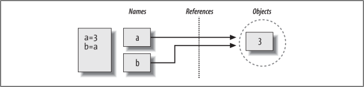

# Chapter 4 - Introduction into Python's objects types

Python programmes:

1. Programmes consist of modules.
2. Modules contain operators.
3. Operators contain expressions.
4. Expressions create and process objects.

Built-in objects types
| Object Type          | Example                                          |
| -------------------- | ------------------------------------------------ |
| Numbers              | 1234, 3.1415, 3+4j, 0b11, Decimal(), Fraction()  |
| Strings              | 'spam', "Bob's", b'a\x01c', u'sp\xc4m'           |
| Lists                | [1, [2, 'three'], 4.5], list(range(10))          |
| Dictionaries         | {'food': 'spam', 'taste': 'yum'}, dict(hours=10) |
| Tuples               | (1, 'spam', 4, 'U'), tuple('spam'), namedtule    |
| Files                | open('eggs.txt'), open(r'C:\ham.bin'), 'wb'      |
| Sets                 | set('abc'), ('a', 'b', 'c')                      |
| Other main types     | boolean, types themself, None                    |
| Program unit types   | Functions, modules, classes                      |
| Implementation types | Compiled code, stack traceback                   |

## Numbers

    >>> 3.1415 * 2             # repr: as code
    6.2830000000000004
    >>> print(3.1415 * 2)      # str: user-friendly
    6.283

## Strings

Python supports a *raw* string literal that turns off the backslash escape mechanism. Such literals start with the letter *r* and are userful for strings like directory paths (`r'C:\text\new'`).

Python supports coding non-ASCII characters with __\x__  hexadecimal and short __\u__ and long __\U__ Unicode escapes, as well as file-wide encodings declared in program source files.

    >>> 'sp\xc4\u00c4\U000000c4m'
    'spÄÄÄm'

... Unicode processing mostly reduces to transferring text data to and from *files* -- text is *__encoded__* to bytes when stored in a file, and *__decoded__* intop characters (a.k.a code points) when read back into memory.

## Dictionaries - Sorting Keys

`sorted` call returns the result and sorts a variety of object types:

    >>> D
    {'a': 1, 'c': 3, 'b': 2}
    >>> for key in sorted(D):
            print(key, '=>', D[key])
    a => 1
    b => 2
    c => 3

## Iteration and Optimization

An object is *iterable* if it is either a physically stored sequence in memory, or an object that generates one item at a time in the context of an iteration operation -- a sort of "virtual" sequence.

The *generator* comprehension expression is such an object: its values aren't stored in memory all at once, but are produced as requested, usually by iteration tools.

The list comprehensio, though, and related functional programming tools like *map* and *filter*, will often run faster than a *for* loop today on some types of code.

## Other Core Types

    >>> X = set('spam')
    >>> Y = {'h', 'a', 'm'}
    >>> X, Y
    {'m', 'a','p', 's'}, {'m', 'a', 'h'})
    >>> X & Y                   # Intersection
    {'m', 'a'}
    >>> X | Y                   # Union
    {'m', 'h', 'a', 'p', 's'}
    >>> X - Y                   # Difference
    {'p', 's'}
    >>> X > Y                   # Superset
    False

# Chapter Summary

An "immutable" object is an object that cannot be changed after it is created. Numbers, strings, and tuples in Python fall into this category.

A "sequence" is a positionally ordered collection of objects. Strings, lists, and tuples are all sequences in Python. They share common sequence operations, such as indexing, concatenation, and slicing, buy also have type-specific method calls.

"Polymorphism" means that the meaning of an operation (like a +) depends on the objects being operated on. This turns out to be a key idea behind using Python well - not constraining code to specific types makes that code automatically applicable to many types.

# Chapter 5 - Numeric Types

|Literal                                |Interpretation                         |
|---------------------------------------|---------------------------------------|
|1234, -24, 0.99999999999999            | Intergers (unlimited size)            |
|1.23, 1., 3.14e-10, 4E210, 4.0e+210    | Floating-point numbers                |
|0o177, 0x9ff, 0b101010                 | Octal, hex, and binary literals       |
|3+4j, 0+4.0j, 3j                       | Complex numbers literals              |
|set('spam'), {1, 2, 3, 4}              | Sets                                  |
|Decimal('1.0'), Fraction(1, 3)         | Decimal and fraction extension types  |
|bool(x), True, False                   | Boolean type and constants            |

## Hex, Octal, Binary: Literals and Conversions

In memory, an integer's value is the same, regardless of the base we use to specify it.

    >>> 0o1, 0o20, 0o377            # Octal literals
    (1, 16, 255)
    >>> 0x01, 0x21, 0xFF            # Hex literals
    (1, 16, 255)
    >>> 0b1, 0b10000, 0b11111111    # Binary literals
    (1, 16, 255)
You can also convert integers to base-specific strings with *string formatting* methgod calls and expressions, which return just digits, not Python literal strings:

    >>> '{0:o}, {1:x}, {2:b}'.format(64, 64, 64) # Numbers=>digits
    '100, 40, 1000000'
    >>> '%o, %x, %x, %X' % (64, 64, 255, 255) # Similar, in all Pythons
    '100, 40, ff, FF'

## Bitwise Operations

As a rule of thumb, if you find yourself wanting to flip bits in Python, you should think about which language you're really coding.

## Fraction Type

The floating-point limitation is especially apparent for values that cannot be represented accurately given their limited number of bits in memory. Both __Fraction__ and __Decimal__ provide ways to get exact results, albeit at the cost of some speed and code verbosity.

    >>> 0.1 + 0.1 + 0.1 - 0.3       # This should be zero (close, but not exact)
    5.551115123125783e-17

    >>> from fractions import Fraction
    >>> Fraction(1, 10) + Fraction(1, 10) + Fraction(1, 10) - Fraction(3, 10)
    Fraction(0, 1)
    
    >>> from decimal import Decimal
    >>> Decimal('0.1') + Decimal('0.1') + Decimal('0.1') - Decimal('0.3')
    Decimal('0.0')

Moreover, fractions and decimals both allow more intuitive and accurate results than floating points sometimes can, in diffent ways - by using rational representation and by limiting precision.

## Fraction conversions and mixed types

To support fraction conversions, floating-point objects now have a method that yields their numerator and denominatior ratio, fractions have a __from_float__ method, and __float__ accepts a __Fraction__ as an argument.

    >>> (2.5).as_integer_ratio()                # float object method
    (5, 2)
    >>> f = 2.5
    >>> z = Fraction(*f.as_integer_ratio())     # Convert float -> fraction: two args
    >>> z                                       # Same as Fraction(5, 2)
    Fraction(5, 2)
    >>> x                                       # x from prior interaction
    Fraction(1, 3)
    >>> x + z
    Fraction(17, 6)                             # 5/2 + 1/3 = 15/6 + 2/6
    >>> float(x)                                # Convert fraction -> float
    0.3333333333333333
    >>> float(z)
    2.5
    >>> float(x + z)
    2.8333333333333335
    >>> 17 / 6
    2.8333333333333335
    >>> Fraction.from_float(1.75)               # Convert float -> fraction: other way
    Fraction(7, 4)
    >>> Fraction(*(1.75).as_integer_ratio())
    Fraction(7, 4)

## Sets

The *set* - an unordered collection of unique and __immutable objects__ that supports opertaions corresponding to mathematical sets.
... although the set expressions shown ealier generally require two sets, their method-based counterparts can often work with *any iterable type* as well:

    >>> S = set([1, 2, 3])
    
    >>> S | set([3, 4])         # Expressions require both to be sets
    set([1, 2, 3, 4])
    >>> S | [3, 4]
    TypeError: unsupported operand type(s) for |: 'set' and 'list'

    >>> S.union([3, 4])         # But their methods allow any iterable
    set([1, 2, 3, 4])
    >>> S.intersection((1, 3, 5))
    set([1, 3])
    >>> S.issubset(range(-5, 5))
    True

## Why sets

Sets can be used to *isolate differences* in lists, strings, and other iterable objects too - simply convert to sets and take the difference - though again the unordered nature of sets means that the results may not match that of the originals:

    >>> set([1, 3, 5, 7]) - set([1, 2, 4, 5, 6])        # Find list differences
    {3, 7}
    >>> set('abcdefg') - set('abdghij')                 # Find string differences
    {'c', 'e', 'f'}
    >>> set('spam') - set(['h', 'a', 'm'])              # Find differences, mixed
    {'p', 's'}
    >>> set(dir(bytes)) - set(dir(bytearray))           # In bytes but not bytearray
    {'__getnewargs__'}
    >>> set(dir(bytearray)) - set(dir(bytes))
    {'append', 'copy', '__alloc__', '__imul__', 'remove', 'pop', 'insert', ...more...]

You can also use sets to perform *order-neutral equality* tests by converting to a set before the test, because order doesn't matter in a set. More formally, two sets are *equal* if and only if every element of each set is contained in the other - that is, each is a subset of the other, regardless of order.

# Chapter 6 - The Dynamic Typing Interlude

In Python, types are determined automatically at runtime, not in response to declarations in your code. This means that you never declare variables ahead of time.

## Variables, Objects, and References

- *Variables* are entries in a system table, with spaces for links to objects.
- *Objects* are pieces of allocated memory, with enough space to represent the values for which they stand.
- *References* are automatically followed pointers from variables to objects.
  
Technically speaking, objects have more structure than just enough space to represent their values. Each object also has two standard header fields: a *type designator* used to mark the type of the object, and a *reference counter* used to determine when it's OK to reclaim the object.

## Objects Are Garbage-Collected

Whenever a name is assigned to a new object, the space held by the prior object is reclainmed if it is not referenced by any other name or object.

The most immediately tangible benefit of garbage collection is that it means you can use objects liberally without ever needing to allocate or free up space in your script. Python will clean up unused space for you as your program runs. In practice, this eliminates a substantial amout of bookekeeping code required in lower-level languages such as C and C++.

## Shared References

This scenario in Python - with multiple names referencing the same object - is usually called a *shared reference* (and sometimes just a *shared object*).

    >>> L1 = [2, 3, 4]  # A mutable object
    >>> L2 = L1         # Make a reference to the same object
    >>> L1[0] = 24      # An in-place change

    >>> L1              # List is different
    [24, 3, 4]
    >>> L2              # But so is L2!
    [24, 3, 4]

This behaviour only occurs for mutable objects that support in-place changes, and is usually what you want, but you should be aware of how it works, so that it is expected. It is also just the default: if you don't want such behaviour, you can request that Python *copy* objects instead of making references.

Note that the standard library *copy* module has a call for copying any object type genericallym, as well as a call for copying nested object structures - a dictionary with nested lists, for example:

    import copy
    X = copy.copy(Y)        # Make top-level "shallow" copy of any object Y
    X = copy.deepcopy(Y)    # Make deep copy of any object Y: copy all nested parts
