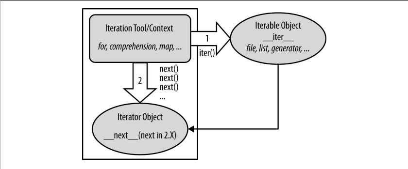

# Chapter 10 - Introducing Python Statements

## Why Indentation Syntax?

Aligning your code according to its logical structure is a major part of making it readable, and thus reusable and maintainable, by yourself and others.

# Chapter 11 - Assignments, Expressions, and Prints

## Extended sequence unpacking

In Python 3.X (only), a new form of sequence assignment allows us to be more flexible in how we select portions of a sequence to assign.

    a, *b = 'spam'

The above code line, for example, matches `a` with the first character in the string on the right and `b` with the rest: `a` is assigned `'s'`, and `b` is assigned `'pam'`. This provides a simpler alternative to assigning the results of manual slicing operations.

A single *starred name*, `*X` can be used in the assignment target in order to specify a more general matching against the sequence - the starred name is assingned a list, which collects all items in the sequence not assigned to other names. This is especially handy for common coding patterns such as splitting a sequence into its "front" and "rest".

    >>> seq = [1, 2, 3, 4]
    >>> a, *b = seq
    >>> a
    1
    >>> b
    [2, 3, 4]

    >>> *a, b = seq
    >>> a
    [1, 2, 3]
    >>> b
    4

    >>> a, *b, c = seq
    >>> a
    1
    >>> b
    [2, 3]
    >>> c
    4

### Boundary cases

1. The starred name may match just a single item, but is always assigned a list:

        >>> seq = [1, 2, 3, 4]
        >>> a, b, c, *d = seq
        >>>print(a, b, c, d)
        1 2 3 [4]

2. If there is nothing left to match the starred name, it is assigned an empty list, regardless of where it appeares:

        >>> a, b, c, d, *e = seq
        >>> print(a, b, c, d, e)
         2 3 4 []

        >>> a, b, *e, c, d = seq
        >>> print(a, b, c, d, e)
        1 2 3 4 []

3. Errors can still be triggered if there is more than one starred name, if there are too few values and no star (as before), and if the starred name is not itself coded inside a sequence:

        >>> a, *b, c, *d = seq
        SyntaxError: two starred expressions in assignment
        
        >>> a, b = seq
        ValueError: too many values to unpack (expected 2)

        >>> *a = seq
        SyntaxError: starred assignment targer must be in a list or tuple

        >>> *a, = seq
        >>> a
        [1, 2, 3, 4]

## Multiple-target assingment and shared references

Keep in mind that there is just one object here, shared by all three variables (they all wind up pointing to the same object in memory). This behaviour is fine for immutable types - for example, when initializing a set of counters to zero.

## Augmented assignment and shared references

This behaviour is usually what we want, but notice that it implies that the `+=` is an *in-place* change for lists; thus, it is not exactly like `+` concatenation, which always makes a *new* object. As for all shared reference case, this difference might matter if other names reference the object being changed:

    >>> L = [1, 2]
    >>> M = L                       # L and M reference the same object
    >>> L = L + [3, 4]              # Concatenation makes a new object
    >>> L, M                        # Changes L but not M
    ([1, 2, 3, 4], [1, 2])

    >>> L = [1, 2]
    >>> M = L
    >>> L += [3, 4]                 # But += really means extend
    >>> L, M                        # M sees the in-place change too!
    ([1, 2, 3, 4], [1, 2, 3, 4])

This only matters for mutables like lists and dictionaries, and it is a fairly obscure case. As always, make copies of your mutable objects if you need to break the shared reference structure.

## Varible Name Rules

- Names that begin with a single underscore (`_X`) are not imported by a `from model import *` statement.
- Names that have two leading and trailing undescores (`__X__`) are system-defined names that have special meaning to the interpreter.
- Names that begin with two underscores and do not end with two more (`__X`) are localized to enclosing classes.
- The name that is just a single underscore (`_`) retains the result of the expression when you are working interactively.

## Print Operations

Along with the standard input and error streams, standard output stream is one of three data connections created when your script starts.

### Call format

    print([object, ...][, sep=' '][,end='\n'][, file=sys.stdout][, flush=false])

In English, this built-in function prints the textual representation of one or more `objects` separated by the string `sep` and followed by the string `end` to the stream `file`, flushing buffered output or not per `flush`.

### Manual stream redirection

In general, `print` and `sys.stdout` are directly related as follows. This statement:

    print(X, Y)

is equivalent to the longer:

    import sys
    sys.stdout.write(str(X) + ' ' + str(Y) + '\n')

Here, we reset `sys.stdout` to a manually opened file named *log.txt*:

    import sys
    sys.stdout = open('log.txt', 'a')       # Redirects prints to a file
    ...
    print(x, y, x)                          # Shows up in log.txt

The `print` operations are happy to keep calling `sys.stdout`'s `write` method, no matter what `sys.stdout` happens to refer to. Because there is just one `sys` module in your process, assigning `sys.stdout` this way will redirect every `print` anywhere in your program.

# Chapter 12 - if Tests and Syntax Rules

## Multiway Branching

You usually code *multiway branching* as a series of `if`/`elif` tests and occasionally by indexing dictionaries or searching lists. Because dictionaries and lists can be buit at runtime dynamically, they are sometimes more flexible that hardcoded `if` logic in scripts:

    >>> branch = {
        'spam': 1.25,
        'ham': 1.99,
        'eggs': 0.99,
    }
    >>> print(branch.get('spam', 'Bad choice'))
    1.25

Though `if`/`elif` tests are perhaps more readable, the potential downside of it is that, short of constructing it as a string and running it with tools like `eval` or `exec`, you cannot construct it at runtimes as easily as a dictionary. In more dynamic programs, data structures offer added flexibility.

## Why You Will Care: Booleans

One common way to use the somewhat unusual behaviour of Python Boolean operators is to select from a set of objects with an `or`:

    X = A or B or C or None

When we define new object types with classes, we can specify their Boolean nature with either the `__bool__` or `__len__` methods. The latter of these is tried if the former is absent and designates false by returning a length of zero.

# Chapter 13 - while and for Loops

## Loop else

Determine whether a positive integer `y` is prime by searching for factors greater than 1:

    x = y // 2                              # For some y>1
    while x > 1:
        if y % x == 0:                      # Remainder
            print(y, ' has factor ', x)
            break                           # Skip else
        x -= 1
    else:                                   # Normal exit
        print(y, ' is prime')

Rather than setting a flag to be tested when the loop is exited, it inserts a `break` where a factor is found. This way, the loop `else` clause can assume that it will be executed only if no factor is found; if you don't hit the `break`, the number is prime.

## Nonexhaustive Traversals: range Versus Slices

The potential advantage to using `range` instead is space: slicing makes a copy of the string, while range does not create a list; for very large strings, they may save memory.

# Chapter 14 - Iterations and Comprehensions

## Iterations: A First Look

An object is considered *iterable* if it is either a physically stored sequence, or an object that produces one result at a time in the context of an iteration tool like a `for` loop. In a sense, iterable objects include both physical sequences and *virtual sequences* computed on demand.

*Iteration protocol* - any object with a `__next__` method to advance to a next result, which raises `StopIteration` at the end of the series of results, is considered an iterator in Python. Any such object may also be stepped through with a `for` loop or other iteration tool, because all iteration tools normally work internally by calling `__next__` on each iteration and catching the `StopIteration` exception to determine when to exit. For some objects the full protocol includes an additional first step to call `iter`, but this isn't required for files.

    >>> for line in open('script2.py'):     # Use file iteratiors to read by lines
    ...     print(line.upper(), end='')     # Calls __next__, catches StopIteration

This is considered the *best* way to read text files line by line today, for three reasons: it's the simplest to code, might be the quickest to run, and is the best in terms of memory usage.

`while` loop may run slower than the iterator-based `for` loop version, because iterators run at C language speed inside Python, whereas the `while` loop version runs Python byte code through the Python virtual machine.

Technically, there is one more piece to the iteration protocol. When the `for` loop begins, it first obtains an iterator from the iterable object by passing it to the `iter` built-in function; the object returned by `iter` in turn has the required `next` method. The `iter` function internally runs the `__iter__` method, much like `next` and `__next__`.

Full iteration protocol, used by every iteration tool in Python, and supported by a wide variety of object types:

- The *iterable* object you request iteration for, whose `__iter__` is run by `iter`
- The *iterator* object returned by the iterable that actually produces values during the iteration, whose `__next__` is run by `next` and raises `StopIteration` when finished producing results.

## List Comprehension Basics

Depending on your Python and code, list comprehensions might run much faster than manual `for` loop statements (often roughly twice as fast) because their iterations are performed at C language speed inside the interpreter, rather than with manual Python code. Especially for larger data sets, there is often a major performance advantage to using this expression.

Anytime we start thinking about performing an operation on each item in a sequence, we're in the realm of list comprehensions.

List comprehensions can become even more complex of we need them to - for instance, they may contain *nested loops*, coded as a series of `for` clauses. In fact, their full syntax allows for any number of `for` clauses, each of which can have an optional associated `if` clause.

    >>> [x + y for x in 'abc' for y in 'lmn']
    ['al', 'am', 'an', 'bl', 'bm', 'bn', 'cl', 'cm', 'cn']

## Multiple Versus Single Pass Iterators

It's important to see how the `range` object differs from the built-ins described further - it supports `len` and indexing, it is not its own iterator (you make one with `iter` when iterating manually), and it supports multiple iterators over its result that remember their positions independently.

By contrast, `zip`, `map`, and `filter` do not support multiple active iterators on the same result; because of this the `iter` call is optional for stepping through such objects' results - their `iter` is themselves:

    >>> Z = zip((1, 2, 3), (11, 12, 13))
    >>> I1 = iter(Z)
    >>> I2 = iter(Z)                        # Two iterators on one zip
    >>> next(I1)
    (1, 11)
    >>> next(I1)
    (2, 12)
    >>> next(I2)                            # I2 is at same spot as I1!
    (3, 13)

    >>> R = range(3)
    >>> I1, I2 = iter(R), iter(R)           # But range allows many iterators
    >>> [next(I1), next(I1), next(I1)]
    [0, 1, 2]
    >>> next(I2)
    0

Multiple iterators are usually supported by returning new objects for the `iter` call; a single iterator generally means an object returns itself.

## Other Iteration Topics

- User-defined functions can be turned into iterable *generator functions*, with `yield` statements.
- List comprehensions morph into iterable *generator expressions* when coded in parenthese.
- User-defined classes are made iterable with `__iter__` or `__getitem__` *operator overloading*.

# Chapter 15 - The Documentation Interlude

Documentation strings (docstrings) are considered best for larger, functional documentation, describing the use of modules, functions, classes, and methods in your
code. Hash-mark comments are today best limited to smaller-scale documentation
about arcane expressions or statements at strategic points on your code. This is
partly because docstrings are easier to find in a source file, but also because they
can be extracted and displayed by the PyDoc system.
